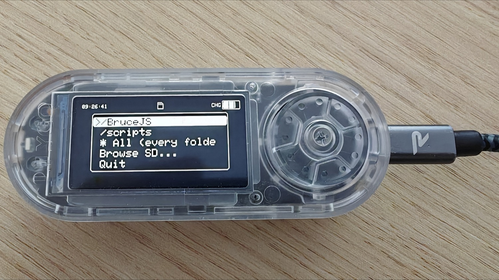
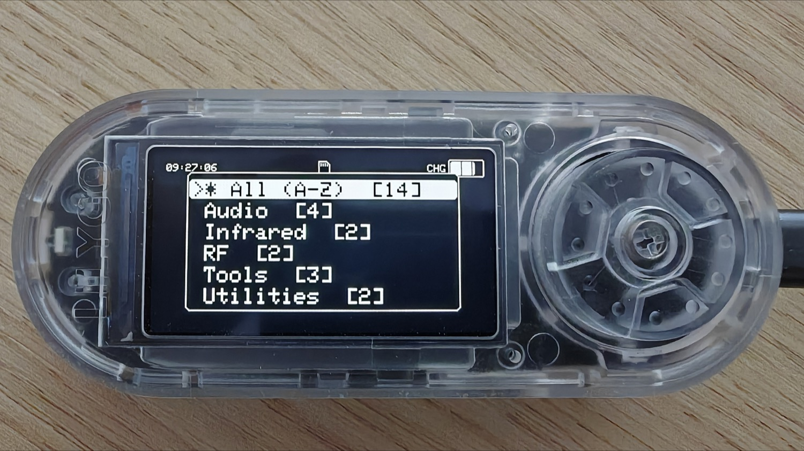

# 🚀 Bruce Launcher — menu de favoris pour tes scripts JS

  

> **EN** — A **launcher / favorites menu** for your JavaScript scripts on the **[Bruce firmware](https://github.com/BruceDevices/firmware)**. It **recursively scans** `/BruceJS`, `/scripts`, `/BruceScripts` **and their sub-folders**, groups scripts by category, and runs the one you pick with `load()`. Perfect for **App Store** scripts that get filed into sub-folders (`wifi/`, `RFID/`, …) and therefore **don't appear** in the built-in *Interpreter* menu. Set it as your **Startup App** to boot straight into your own menu.

Un **lanceur / menu de favoris** pour tes scripts JavaScript sur le firmware **[Bruce](https://github.com/BruceDevices/firmware)** (testé sur **LilyGO T-Embed CC1101**). Il **scanne récursivement** `/BruceJS`, `/scripts`, `/BruceScripts` **et leurs sous-dossiers**, regroupe les scripts par catégorie, et lance celui que tu choisis via `load()`.

👉 **Le problème qu'il résout :** l'**App Store** de Bruce range les scripts téléchargés dans des **sous-dossiers** (`wifi/`, `RFID/`, `ir/`…). Or le menu **Interpreter** natif n'affiche que la **racine** d'un dossier → ces scripts sont **invisibles**. Ce lanceur les retrouve tous et te fait un vrai menu.

| Choix du dossier | Catégories (sous-dossiers) |
|------------------|----------------------------|
|  |  |

## ✨ Fonctionnalités

- **Scan récursif** (jusqu'à 4 niveaux) de `/BruceJS`, `/scripts`, `/BruceScripts`.
- **Menu à 3 niveaux** :
  1. **Dossier** — `/BruceJS` (défaut), un autre, **`* Tout`**, ou **`Browse SD...`** pour pointer n'importe quel dossier de la SD.
  2. **Catégorie** — les sous-dossiers (wifi, RFID, ir…) avec le **nombre de scripts**, ou **`* All (A-Z)`**.
  3. **Script** → lancé via `load()`.
- **Retour au menu** automatique quand un script se termine (ou fait `exit()`).
- **Explorateur SD** intégré (`..` pour remonter, *Pick HERE* pour choisir le dossier courant).
- Se **masque lui-même** de la liste.

## 🚀 Installation

1. Copie **`Launcher.js`** à la **racine** d'un dossier lu par Bruce : **`/BruceJS`** (recommandé), `/scripts` ou `/BruceScripts`.
2. Sur l'appareil : **Interpreter → `Launcher.js`**.
3. **(Astuce)** Mets-le en **Config → Startup App** → au démarrage tu tombes directement sur ton menu de favoris. 🎯

## ⚙️ Réglages (en tête du script)

- `ROOTS` — dossiers scannés par défaut.
- `MAX_DEPTH` — profondeur de recherche récursive (4 par défaut).
- `SELF` — noms de fichiers à ne pas lister (le lanceur lui-même).

## 📝 Notes

- Utilise les fonctions natives de l'interpréteur : `storage.readdir(dir, {withFileTypes:true})` et le global **`load(path)`**.
- La **catégorie** = le premier sous-dossier sous le dossier choisi (reflète les catégories de l'App Store). Les scripts à la racine sont regroupés sous **`(root)`**.
- Interface en **anglais** (comme le reste du firmware Bruce).

## ☕ Un café ?

## 📄 Licence

MIT — voir [LICENSE](LICENSE). Par **koua29** (Arnaud).

---

## 🛒 Matériel / Hardware

Le matériel utilisé pour ce projet — liens affiliés Amazon :

|  |  |
|:---:|:---:|
| 🔌 **[LilyGO T-Embed CC1101](https://link.amazon/B0cgD7wou)** | 📡 **[Kit d'antennes SMA](https://link.amazon/B0eMlSqeZ)** |

En tant que Partenaire Amazon, je réalise un bénéfice sur les achats remplissant les conditions requises. · As an Amazon Associate I earn from qualifying purchases.
